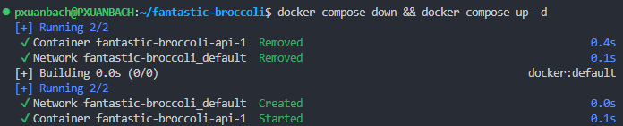

Hey, welcome to my blog!

## Introduction

A few months ago, I worked on a project that utilized Docker and Nginx to deploy the product on Digital Ocean’s VPS. Everything at that time was quite primitive, I had to set up everything from scratch. From containerizing the application to creating a CI/CD pipeline to build, manage, and deploy different Docker image versions.

<!--truncate-->

Docker is a great tool and I love using it in my workflow. I define the Docker services in the configuration file, then pull, up and down the containers to make sure they are up to date. But we have a problem: the time between when I down the container and when I up it. It took **2 minutes** of downtime in total. That’s unacceptable for a product deployed for end-users.


So I implemented a Zero downtime deployment strategy for that project. The BLUE-GREEN strategy is a basic deployment process, but it’s great when simplicity gets the job done. 

Now, let’s talk about some stuff.

## Configuration before applying

### Docker Compose

I have a configuration file like this:

```yaml showLineNumbers title="./docker-compose.yml"
services:
  api:
    image: pxuanbach/simple-app
    ports:
      - '8000:8000'
    restart: on-failure
```

### Nginx

The `nginx.conf` configuration will look like this:

```plaintext {5} showLineNumbers title="./nginx.conf"
server {
    listen 80 default_server;
    server_name api.app.com;
    location / {
        proxy_pass http://localhost:8000;
        proxy_set_header X-Forwarded-For $proxy_add_x_forwarded_for;
        proxy_set_header Host $host;
        proxy_http_version 1.1;
        proxy_set_header Upgrade $http_upgrade;
        proxy_set_header Connection "upgrade";
        client_max_body_size 64M;
    }
}
```

### Deployment process

It was very easy, and I just followed the steps…

```bash {5} showLineNumbers
docker compose pull

docker compose down

# ---DOWNTIME HERE---

docker compose up
```



Now let's move on to the BLUE-GREEN strategy.

## New configuration

### Docker Compose

To apply the BLUE-GREEN strategy, I need to update this configuration file a bit. I use the **Anchors and aliases** features to have a blue and green service with the same configuration. I only change the port number for the green service.

```yaml showLineNumbers title="./docker-compose.yml"
services:
  api_blue: &api
    image: pxuanbach/simple-app
    ports:
      - '8000:8000'
    restart: on-failure

  api_green: 
    <<: *api
    ports:
      - "8001:8000"
```

### Nginx

Create a copy of the nginx configuration corresponding to the service name and port. For example `api_green.conf`:

```plaintext showLineNumbers title="./api_green.conf"
server {
    listen 80 default_server;
    server_name api.app.com;
    location / {
        proxy_pass http://localhost:8001;
        ...
    }
}
```

### Zero Downtime Deployment

To achieve the goal, I must use the Bash/Shell script. This script will make use of the Docker command line as well as the Nginx. Its goal is to implement the BLUE-GREEN strategy by identifying which service, BLUE or GREEN, is currently active and then standing up the inactive environment in parallel. To avoid downtime, I will update the Nginx configuration before stopping the old container.

```bash showLineNumbers title="./pull.run-service.sh"
#!/bin/bash

# Step 1
BLUE_SERVICE="api_blue"
BLUE_SERVICE_PORT=8000
GREEN_SERVICE="api_green"
GREEN_SERVICE_PORT=8001

TIMEOUT=60  # Timeout in seconds
SLEEP_INTERVAL=5  # Time to sleep between retries in seconds
MAX_RETRIES=$((TIMEOUT / SLEEP_INTERVAL))

# Step 2
if docker ps --format "{{.Names}}" | grep -q "$BLUE_SERVICE"; then
  ACTIVE_SERVICE=$BLUE_SERVICE
  INACTIVE_SERVICE=$GREEN_SERVICE
elif docker ps --format "{{.Names}}" | grep -q "$GREEN_SERVICE"; then
  ACTIVE_SERVICE=$GREEN_SERVICE
  INACTIVE_SERVICE=$BLUE_SERVICE
else
  ACTIVE_SERVICE=""
  INACTIVE_SERVICE=$BLUE_SERVICE
fi

echo "Starting $INACTIVE_SERVICE container"

docker compose pull $INACTIVE_SERVICE

docker compose up -d $INACTIVE_SERVICE

# Step 3
# Wait for the new environment to become healthy
echo "Waiting for $INACTIVE_SERVICE to become healthy..."
sleep 10

i=0
while [ "$i" -le $MAX_RETRIES ]; do
  HEALTH_CHECK_URL="http://localhost:8000/health"
  if [ "$INACTIVE_SERVICE" = "$BLUE_SERVICE" ]; then
    HEALTH_CHECK_URL="http://localhost:$BLUE_SERVICE_PORT/health"
  else
    HEALTH_CHECK_URL="http://localhost:$GREEN_SERVICE_PORT/health"
  fi

  response=$(curl -s -o /dev/null -w "%{http_code}" $HEALTH_CHECK_URL)
  # Check the HTTP status code
  if [ $response -eq 200 ]; then
      echo "$INACTIVE_SERVICE is healthy"
      break
  else
      echo "Health check failed. API returned HTTP status code: $response"
  fi
  i=$(( i + 1 ))
  sleep "$SLEEP_INTERVAL"
done

# Step 4
# update Nginx config
echo "Update Nginx config to $INACTIVE_SERVICE"
cp ./$INACTIVE_SERVICE.conf /your/config/path/api.conf
# restart nginx
nginx -s reload;

sleep 5

# Step 5
# remove OLD CONTAINER
echo "Remove OLD CONTAINER: $ACTIVE_SERVICE"
docker compose rm -fsv $ACTIVE_SERVICE

# remove unused images
(docker images -q --filter 'dangling=true' -q | xargs docker rmi) || true
```

Let’s walk through the script step by step:

1. I define the name and port of the blue and green services. And the maximum retry time to check the status of the container. The value depends on your container initialization time.
Sau đó tiến hành pull phiên bản mới của Docker image về.
2. Execute the docker command to find the inactive service and start it.
3. Check the status of the newly initialized container.
4. Update Nginx configuration and reload it. Using `nginx -s reload` to reload Nginx **usually does not cause downtime**. This is because the command only tells Nginx to reload its configuration, it does not restart the entire process.
5. Clean up some unused stuff (old docker image, old container).

In some cases the command `docker compose rm -fsv` may not work. Easily change it to:

```bash showLineNumbers
docker compose stop $ACTIVE_SERVICE
docker compose rm -f $ACTIVE_SERVICE
```

To deploy the new version, simply run the created script.

```bash showLineNumbers
./pull.run-service.sh
```

# Conclusion

As you can see, we can automate the deployment process with just 1 Bash script. The primary objective is to redirect the proxy to the newest container and then remove the old one.

If you need a project to run a demo on your environment, here are my [Git repository](https://github.com/pxuanbach/demo-blue-green-deployment).

# References

- [Zero-Downtime Deployments with Docker Compose – Max Countryman](https://www.maxcountryman.com/articles/zero-downtime-deployments-with-docker-compose)
- [docker compose rm | Docker Docs](https://docs.docker.com/reference/cli/docker/compose/rm/)