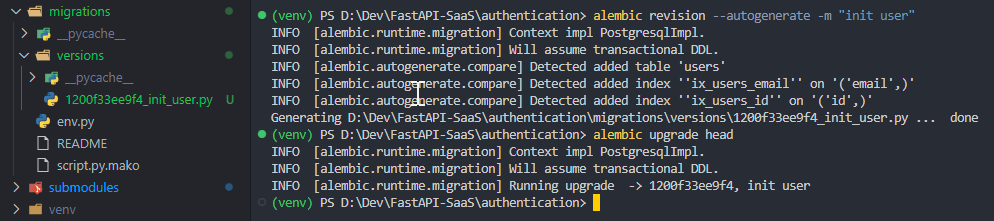

Today, I say “Hi FastAPI”.

Recently, [FastAPI](https://fastapi.tiangolo.com/) has become increasingly popular, partly driven by the current trend of AI innovation. In my opinion, being modern, robust, fast, and micro is what makes me fall in love with this framework.

This post comes with some modules that you will want to have in your project.

<!--truncate-->

## Framework/Library version

This project uses [Python](https://www.python.org/) 3.10 as the environment and [Poetry](https://python-poetry.org/) as the package manager.

The code and examples in this post will use frameworks/libraries with the following versions.

```toml showLineNumbers title="./pyproject.toml"
[tool.poetry.dependencies]
python = "^3.10"
uvicorn = {extras = ["standard"], version = "^0.24.0.post1"}
fastapi = "^0.109.1"
python-multipart = "^0.0.7"
email-validator = "^2.1.0.post1"
passlib = {extras = ["bcrypt"], version = "^1.7.4"}
tenacity = "^8.2.3"
pydantic = ">2.0"
emails = "^0.6"
gunicorn = "^21.2.0"
jinja2 = "^3.1.2"
alembic = "^1.12.1"
python-jose = {extras = ["cryptography"], version = "^3.3.0"}
httpx = "^0.25.1"
psycopg = {extras = ["binary"], version = "^3.1.13"}

sqlmodel = "^0.0.16"

# Pin bcrypt until passlib supports the latest
bcrypt = "4.0.1"
pydantic-settings = "^2.2.1"
sentry-sdk = {extras = ["fastapi"], version = "^1.40.6"}
psycopg2 = "^2.9.9"
asyncpg = "^0.29.0"
```

## Migration

If you work with SQL databases, these are important components you need to set up. What I want to talk about is Alembic.

[Alembic](https://alembic.sqlalchemy.org/) is a lightweight database migration tool for usage with the [SQLAlchemy](https://www.sqlalchemy.org/) Database Toolkit for Python.

To add or initialize a module, you can use the following commands:

```bash
poetry add alembic  # pip install alembic

alembic init migrations
```

*Note that “migrations” is the name of the directory where you want to store your migration versions.*

### Directory structure

```plaintext 
Project/
├── app/
│   └── ...
├── migrations/
│   ├── versions/
│   │   └── ...
│   ├── README
│   ├── env.py
│   └── script.py.mako
├── alembic.ini
├── pyproject.toml
├── poetry.lock
├── README.md
└── ...
```

### alembic.ini

I will use its default configuration. Or go to this link https://alembic.sqlalchemy.org/en/latest/tutorial.html#editing-the-ini-file to get more details.

```toml showLineNumbers title="./alembic.ini"
# A generic, single database configuration.

[alembic]
# path to migration scripts
script_location = migrations

# template used to generate migration files
# file_template = %%(rev)s_%%(slug)s

# sys.path path, will be prepended to sys.path if present.
# defaults to the current working directory.
prepend_sys_path = .
...
```

### env.py

In this version of FastAPI, [SQLModel](https://sqlmodel.tiangolo.com/) appears as an integrated version of SQLAlchemy and Pydantic and is recommended for use in the official documentation.

So instead of using `DeclarativeMeta`, we will use `SQLModel.metadata` in Alembic’s env.

After completing the steps above, the `env.py`  will look like this.

```python showLineNumbers {6-7,22} title="./migrations/env.py"
from logging.config import fileConfig
from sqlalchemy import engine_from_config
from sqlalchemy import pool
from alembic import context

from app.core.db import SQLModel       # <--- CHANGE HERE
from app.core.config import settings   # <--- CHANGE HERE

# this is the Alembic Config object, which provides
# access to the values within the .ini file in use.
config = context.config

# Interpret the config file for Python logging.
# This line sets up loggers basically.
if config.config_file_name is not None:
    fileConfig(config.config_file_name)

# add your model's MetaData object here
# for 'autogenerate' support
# from myapp import mymodel
# target_metadata = mymodel.Base.metadata
target_metadata = SQLModel.metadata    # <--- CHANGE HERE

# other values from the config, defined by the needs of env.py,
# can be acquired:
# my_important_option = config.get_main_option("my_important_option")
# ... etc.
config.set_section_option("alembic", "sqlalchemy.url", str(settings.SQLALCHEMY_DATABASE_URI))  # <--- CHANGE HERE

def run_migrations_offline() -> None:
...
```

*One note is that to achieve the Alembic `—autogenerate` option, you must import the entity representing your table where you import SQLModel into env. For example `app/core/db.py`:*

```python showLineNumbers {22,24-26} title="./app/core/db.py"
from sqlalchemy.ext.asyncio import AsyncSession, create_async_engine
from sqlalchemy.ext.declarative import declarative_base
from sqlalchemy.orm import sessionmaker
from sqlmodel import SQLModel, create_engine

from app.core.config import settings

async_engine = create_async_engine(settings.SQLALCHEMY_DATABASE_URI_ASYNC)
async_session_maker = sessionmaker(
    async_engine,
    class_=AsyncSession,
    expire_on_commit=False,
    autocommit=False,
    autoflush=False,
)

# We still have a second old style sync SQLAlchemy engine for shell and alembic
engine = create_engine(settings.SQLALCHEMY_DATABASE_URI, future=True)
SessionLocal = sessionmaker(bind=engine, autocommit=False, autoflush=False)

Base = declarative_base()
SQLModel.metadata = Base.metadata

# import all models to automatically create migration through Alembic
from app.modules.users.model import UserInDb
...
```

*Alternatively, if you organize your database models within a directory, you can leverage the `__init__.py` file to gather all the models you want Alembic to create migrations automatically. For instance `app/models/__init__.py`:*

```python showLineNumbers {3,4} title="./app/models/__init__.py"
from app.core.db import SQLModel

from .user import UserInDb
from .item import ItemInDb
...
```

And `migrations/env.py`:

```python showLineNumbers {6} title="./migrations/env.py"
from logging.config import fileConfig
from sqlalchemy import engine_from_config
from sqlalchemy import pool
from alembic import context

from app.models import SQLModel       # <--- CHANGE HERE
...
```

### script.py.mako

To make things go smoothly, don't forget to import the `sqlmodel` into this file.

```python showLineNumbers {12} title="./migrations/script.py.mako"
"""${message}

Revision ID: ${up_revision}
Revises: ${down_revision | comma,n}
Create Date: ${create_date}

"""
from typing import Sequence, Union

from alembic import op
import sqlalchemy as sa
import sqlmodel             # <--- CHANGE HERE
${imports if imports else ""}
...
```

### How to use?



- To create a new revision:
    ```bash
    alembic revision --autogenerate -m "message"
    ```

- To migrate:
    ```bash
    alembic upgrade head
    ```

- To undo the latest migration:
    ```bash
    alembic downgrade -1
    ```

- To roll back to a specific revision:
    ```bash
    alembic downgrade <<revision_id>>
    ```

## Conclusion

We discussed an essential module in developing applications with FastAPI: Migration. By carefully and effectively using this module, we can build and maintain powerful and flexible FastAPI applications. Hopefully, this article has given you the overview and knowledge needed to use this important module in your projects.

If you need a project to run a demo on your environment, here are my [Git repository](https://github.com/pxuanbach/fastapi-essential-modules).

See you again!

## References

- [How to get Alembic to recognise SQLModel database model?](https://stackoverflow.com/questions/68932099/how-to-get-alembic-to-recognise-sqlmodel-database-model)
- [Tutorial — Alembic 1.13.2 documentation (sqlalchemy.org)](https://alembic.sqlalchemy.org/en/latest/tutorial.html)
