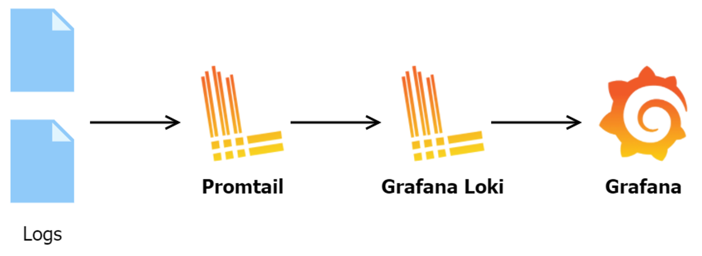

Back to FastAPI again.

This post comes with Logging module that you will want to have in your project.

<!--truncate-->

## Framework/Library version

This project uses [Python](https://www.python.org/) 3.10 as the environment and [Poetry](https://python-poetry.org/) as the package manager.

The code and examples in this post will use frameworks/libraries with the following versions.

```toml showLineNumbers title="./pyproject.toml"
[tool.poetry.dependencies]
python = "^3.10"
uvicorn = {extras = ["standard"], version = "^0.24.0.post1"}
fastapi = "^0.109.1"
python-multipart = "^0.0.7"
email-validator = "^2.1.0.post1"
passlib = {extras = ["bcrypt"], version = "^1.7.4"}
tenacity = "^8.2.3"
pydantic = ">2.0"
emails = "^0.6"
gunicorn = "^21.2.0"
jinja2 = "^3.1.2"
alembic = "^1.12.1"
python-jose = {extras = ["cryptography"], version = "^3.3.0"}
httpx = "^0.25.1"
psycopg = {extras = ["binary"], version = "^3.1.13"}

sqlmodel = "^0.0.16"

# Pin bcrypt until passlib supports the latest
bcrypt = "4.0.1"
pydantic-settings = "^2.2.1"
sentry-sdk = {extras = ["fastapi"], version = "^1.40.6"}
psycopg2 = "^2.9.9"
asyncpg = "^0.29.0"
```

## Logging

This module plays an important role in recording information, warnings, and errors during execution.

Log messages can provide information about system activities, input and output data, important events, and any issues that arise to aid in locating and fixing errors.

Let's dive deeper into this module.

### Log Level

In Python, log level refers to the importance level of a log message and is used to specify the type of that message.


1. **DEBUG**: Log level for debug messages, typically used to record detailed information for debugging and development purposes.
2. **INFO**: Log level for informational messages, often used to record normal operations in the application.
3. **WARNING**: Log level for warning messages, usually used to record unexpected or potential situations that do not affect the application's operation.
4. **ERROR**: Log level for error messages, typically used to record situations that cause errors during application execution.
5. **CRITICAL**: Log level for critical error messages, commonly used to log fatal errors that may prevent the application from continuing.

In my experience, I often use DEBUG log level in the development environment. When the application is moved to production, I will hide the DEBUG level. Typically, only logs from INFO level or higher are allowed to be printed.

To get more knowledge about this part, you can refer to this https://stackoverflow.com/questions/2031163/when-to-use-the-different-log-levels.

### Log Format

By default, the log format looks very simple. The problem is that this simplicity makes it lack information and become difficult to read.


Let's say you put a log inside a function and it's used multiple times. The special thing is that when the system is operating, you can't always sit next to the screen to check whether that function records errors or not? And at what point does the error occur? Ha ha… a classic example.

To solve that problem, log formatting is the key solution. It helps you and your system get through the darkest days.

For example, I have different formats for files and consoles.

```python showLineNumbers {9-10} title="./app/core/logger.py"
console_msg_format = "%(asctime)s %(levelname)s: %(message)s"

# Create the root logger.
logger = logging.getLogger()
logger.setLevel(logging.DEBUG)

# Set up logging to the console.
stream_handler = logging.StreamHandler()
stream_formatter = logging.Formatter(console_msg_format)
stream_handler.setFormatter(stream_formatter)

logger.addHandler(stream_handler)
```

The logs will look like


Even though the log format has been changed, it still doesn't seem easy to follow. Next, what we're going to do to improve it is add color to the log. At this point, I offer a simple solution to make the log better.

```python showLineNumbers {27-28} title="./app/core/logger.py"
class ColoredFormatter(logging.Formatter):
    COLOR_CODES = {
        'DEBUG': '\033[94m',  # blue
        'INFO': '\033[92m',   # green
        'WARNING': '\033[93m',  # yellow
        'ERROR': '\033[91m',  # red
        'CRITICAL': '\033[41m\033[97m'  # red background color and white text
    }
    RESET_CODE = '\033[0m'  # called to return to standard terminal text color

    def format(self, record):
        # Get the color corresponding to the log level
        color = self.COLOR_CODES.get(record.levelname, '')
        # Add color to log messages and reset color at the end
        formatted_message = f"{color}{super().format(record)}{self.RESET_CODE}"
        return formatted_message
        
        
console_msg_format = "%(asctime)s %(levelname)s: %(message)s"

# Create the root logger.
logger = logging.getLogger()
logger.setLevel(logging.DEBUG)

# Set up logging to the console.
stream_handler = logging.StreamHandler()
stream_formatter = ColoredFormatter(console_msg_format)
stream_handler.setFormatter(stream_formatter)

logger.addHandler(stream_handler)
```

The result ^_^:


### Logging to Multiple Sources

We have customized the log format for printing to the console in the above sections. If we only print to the console, when we restart the application, the logs on the console will be reset... We have lost all the old logs.

So, we need to store logs to multiple sources. As far as I know, we can store locations like files, databases, or online log services.

You can integrate with other tools like [Elasticsearch, Logstash, Kibana (ELK Stack)](https://www.elastic.co/elastic-stack).


Or [Promtail, Loki and Grafana](https://grafana.com/docs/loki/latest/) for simpler setup.



In this post, we will discuss how to log into a file and some considerations to remember regarding this process.

With just a few lines of code, you can log into a specific file anywhere you want.

```python showLineNumbers {8} title="./app/core/logger.py"
# Create the root logger.
logger = logging.getLogger()
logger.setLevel(logging.DEBUG)

logging.basicConfig(level=logging.DEBUG)

# Set up logging to the file.
file_handler = logging.FileHandler('app.log') # <--- File location
file_handler.setLevel(logging.DEBUG)
formatter = logging.Formatter('%(asctime)s - %(levelname)s - %(message)s')
file_handler.setFormatter(formatter)

logger.addHandler(file_handler)
```

Let’s see the results. 


As you can see, `app.log` automatically creates and contains all the logs we print. However, that's not enough. We cannot simply dump all the system logs into a single file and monitor the logs from there. It is terrible! (＃°Д°)

To avoid that, what we need is a log rotation. It helps us manage file size, the maximum number of backup files if the file size exceeds the threshold.

```python showLineNumbers {34-36,40} title="./app/core/logger.py"
# Define default logfile format.
file_name_format = "{year:04d}{month:02d}{day:02d}.log"

# Define the default logging message formats.
file_msg_format = "%(asctime)s %(levelname)-8s: %(message)s"
console_msg_format = "%(levelname)s: %(message)s"

# Define the log rotation criteria.
max_bytes = 1024**2   # ~ 1MB
backup_count = 100

# Create the root logger.
logger = logging.getLogger()
logger.setLevel(logging.DEBUG)

# Validate the given directory.
dir="log"
dir = os.path.normpath(dir)

# Create a folder for the logfiles.
if not os.path.exists(dir):
    os.makedirs(dir)

# Construct the name of the logfile.
t = datetime.datetime.now()
file_name = file_name_format.format(
    year=t.year,
    month=t.month,
    day=t.day,
)
file_name = os.path.join(dir, file_name)

# Set up logging to the logfile.
file_handler = logging.handlers.RotatingFileHandler(
    filename=file_name, maxBytes=max_bytes, backupCount=backup_count
)
file_handler.setLevel(logging.DEBUG)
file_formatter = logging.Formatter(file_msg_format)
file_handler.setFormatter(file_formatter)
logger.addHandler(file_handler)
```

If you're not familiar with how this module works, the `RotatingFileHandler` class has the following description:

> Rollover occurs whenever the current log file is nearly maxBytes in length. If backupCount is >= 1, the system will successively create new files with the same pathname as the base file, but with extensions ".1", ".2" etc. appended to it. For example, with a backupCount of 5 and a base file name of "app.log", you would get "app.log", "app.log.1", "app.log.2", ... through to "app.log.5". The file being written to is always "app.log" - when it gets filled up, it is closed and renamed to "app.log.1", and if files "app.log.1", "app.log.2" etc. exist, then they are renamed to "app.log.2", "app.log.3" etc. respectively.

> If maxBytes is zero, rollover never occurs.

In the example, I set the `maxBytes` value to 1MB, so if the size of the log file reaches 1MB, it will be moved to a backup file (`20240405.log.1`, `20240405.log.2`), and new logs will continue to be written to the current file (`20240405.log`).

\

### Performance

Logging in the system may seem lightweight, but in reality, it still consumes time and a certain amount of system resources, especially when performing concurrent logging from multiple threads or processes.

Specifying log levels, optimizing log structure, and configuring rotation also significantly reduce the burden on the system. Additionally, we can consider asynchronous logging and reduce the number of logging operations to reduce the load on the storage system, especially when handling large log volumes.

In FastAPI, you can use [Background Tasks](https://fastapi.tiangolo.com/tutorial/background-tasks/) to log asynchronously, which reduces system load and request latency.

```python showLineNumbers {9,11}
from typing import Any
from fastapi import BackgroundTasks
import logging

@self.router.get(
    "/something"
)
async def handle_something(
    bg_task: BackgroundTasks
) -> Any:
    bg_task.add_task(logging.info, f"This is log")
    return { "something": True }
```

### Integration with FastAPI

In my experience, you should wrap up all configurations into a function and call it when initializing the FastAPI application. In the new FastAPI version, [Lifespan Events](https://fastapi.tiangolo.com/advanced/events/#lifespan) will help you do that.

For instance:

```python showLineNumbers {8,16} title="./app/main.py"
from contextlib import asynccontextmanager
from app.core.logger import setup as setup_logging
from app.core.config import settings

@asynccontextmanager
async def lifespan(app: FastAPI):
    # start up
    setup_logging(minLevel=logging.DEBUG)
    yield
    # shut down
    pass

app = FastAPI(
    title=settings.PROJECT_NAME,
    openapi_url=f"{settings.API_STR}{settings.API_VERSION_STR}/openapi.json",
    lifespan=lifespan
)
```

## To sum up

We discussed an essential module in developing applications with FastAPI: Logging. By carefully and effectively using this module, we can build and maintain powerful and flexible FastAPI applications. Hopefully, this article has given you the overview and knowledge needed to use this important module in your projects.

If you need a project to run a demo on your environment, here are my [Git repository](https://github.com/pxuanbach/fastapi-essential-modules).

See you again!

## References

- [borntyping/python-colorlog: A colored formatter for the python logging module (github.com)](https://github.com/borntyping/python-colorlog)
- [acschaefer/duallog: Python package to enable simultaneous logging to console and logfile (github.com)](https://github.com/acschaefer/duallog/tree/master)