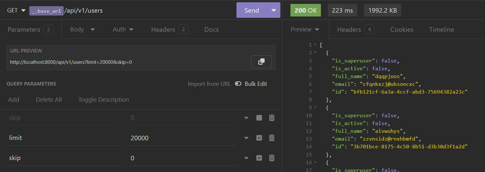
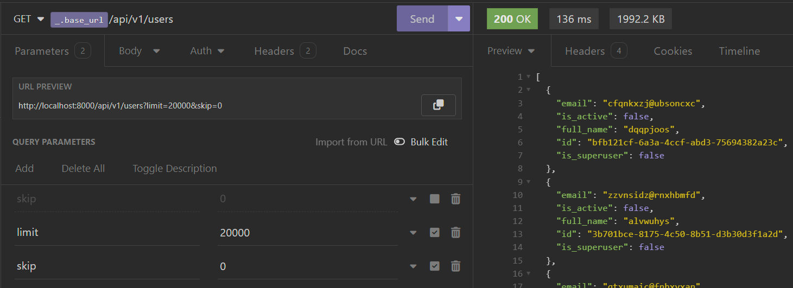
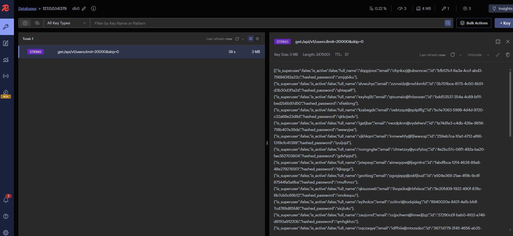

Hello, we meet again!

In the previous post, I introduced two quite important modules in a project, which are Migration and Logging. In this article, I will introduce the Caching module. 

I hope you enjoy it!

<!--truncate-->

## Framework/Library version

This project uses [Python](https://www.python.org/) 3.10 as the environment and [Poetry](https://python-poetry.org/) as the package manager.

The code and examples in this post will use frameworks/libraries with the following versions.

```toml showLineNumbers title="./pyproject.toml"
[tool.poetry.dependencies]
python = "^3.10"
uvicorn = {extras = ["standard"], version = "^0.24.0.post1"}
fastapi = "^0.109.1"
python-multipart = "^0.0.7"
email-validator = "^2.1.0.post1"
passlib = {extras = ["bcrypt"], version = "^1.7.4"}
tenacity = "^8.2.3"
pydantic = ">2.0"
emails = "^0.6"
gunicorn = "^21.2.0"
jinja2 = "^3.1.2"
alembic = "^1.12.1"
python-jose = {extras = ["cryptography"], version = "^3.3.0"}
httpx = "^0.25.1"
psycopg = {extras = ["binary"], version = "^3.1.13"}

sqlmodel = "^0.0.16"

# Pin bcrypt until passlib supports the latest
bcrypt = "4.0.1"
pydantic-settings = "^2.2.1"
sentry-sdk = {extras = ["fastapi"], version = "^1.40.6"}
psycopg2 = "^2.9.9"
asyncpg = "^0.29.0"
redis = {extras = ["hiredis"], version = "^5.0.3"}
orjson = "^3.10.0"
```

## Caching

We will explore integrating a caching module into FastAPI. This caching module will automatically store the results of previous API requests, thereby improving response times and reducing server load. There are many other places where you can cache data, such as In-memory, Redis, DynamoDB,… This section will implement a simple Redis caching solution for APIs.

First, we should install the [Redis](https://github.com/redis/redis-py) package. 

```bash
poetry add redis   # pip install redis
```

### Prepare an adapter for Redis

When working with Redis, we must manage connecting and disconnecting to Redis as necessary. Additionally, certain features require additional logic to integrate with the system seamlessly.

So, I define some functions that I want to use such as…

- Connect.
- Disconnect.
- Add a key to Redis.
- Check the key exists in Redis.

Let’s build it.

```python showLineNumbers title="./app/core/redis.py"
from typing import Any, Dict, Tuple
import redis.asyncio as aioredis
import logging
from app.utils import ORJsonCoder

class RedisClient:
    async def connect(self, redis_url: str):
        self.pool = aioredis.ConnectionPool().from_url(redis_url)
        self.redis = aioredis.Redis.from_pool(self.pool)
        if await self.redis.ping():
            logging.info("Redis connected")
            return True
        logging.warning("Cannot connect to Redis")
        return False
    
    async def add_to_cache(self, key: str, value: Dict, expire: int) -> bool:
        response_data = None
        try:
            response_data = ORJsonCoder().encode(value)
        except TypeError:
            message = f"Object of type {type(value)} is not JSON-serializable"
            logging.error(message)
            return False
        cached = await self.redis.set(name=key, value=response_data, ex=expire)
        if cached:
            logging.info(f"{key} added to cache")
        else:  # pragma: no cover
            logging.warning(f"Failed to cache key {key}")
        return cached
    
    async def check_cache(self, key: str) -> Tuple[int, str]:
        pipe = self.redis.pipeline()
        ttl, in_cache = await pipe.ttl(key).get(key).execute()
        if in_cache:
            logging.info(f"Key {key} found in cache")
        return (ttl, in_cache)

    async def disconnect(self):
        if await self.redis.ping():
            await self.redis.aclose()
            logging.info("Redis disconnected")
        return None

redis_client = RedisClient()
```

In this class, you might wonder about the `ORJsonCoder` module. Where is it? What can it do?

This module provides methods to perform JSON encoding and decoding using the [orjson](https://github.com/ijl/orjson) library, aimed at increasing speed and performance compared to standard JSON libraries in Python.

```python showLineNumbers title="./app/utils/orjson_coder.py"
from typing import Any, Union
from fastapi.encoders import jsonable_encoder
import orjson

class ORJsonCoder:
    def encode(cls, value: Any) -> bytes:
        return orjson.dumps(
            value,
            default=jsonable_encoder,
            option=orjson.OPT_NON_STR_KEYS | orjson.OPT_SERIALIZE_NUMPY,
        )

    def decode(cls, value: Union[bytes | str]) -> Any:
        return orjson.loads(value)
```

### Implement logic for caching

Next, we will create a module to provide caching features based on `RedisClient`. To clarify what we need, let's explore the concept of Redis a bit.

#### What is Redis?

> Redis (**RE**mote **DI**ctionary **S**erver) is an open source, in-memory, NoSQL key/value store that is used primarily as an application cache or quick-response database.
[*— By IBM —*](https://www.ibm.com/topics/redis)


So, to effectively use Redis as a cache, we need an efficient strategy for creating keys and values. Fortunately, Redis now supports various [data types](https://redis.io/docs/latest/develop/data-types/) such as strings, hashes, lists, sets, sorted sets, and JSON…

Another thing to keep in mind is what to cache and how long to keep it in cache.

#### What to cache?

> We don't want to cache many keys that change continuously.
> We don't want to cache many keys that are requested very rarely.
> We want to cache keys that are requested often and change at a reasonable rate. For an example of key not changing at a reasonable rate, think of a global counter that is continuously [INCR](https://redis.io/docs/latest/commands/incr/)emented.
> [— By Redis Docs —](https://redis.io/docs/latest/develop/use/client-side-caching/#what-to-cache)

#### How long to keep it?

This is a question that you need to answer for yourself; everything depends on the logic of your system. 

Some systems use Redis to implement a whitelist strategy for their authorization tokens, so the time to keep that key in the cache memory could be the token's lifespan. 

They also implement data caching for high-traffic APIs with large response data, where the data returned from these APIs has minimal changes. The time to keep the key in the cache memory could be either the time it takes for a change to occur or just enough time to ensure users aren't stuck with outdated data for too long.

Suppose you have complex computational tasks that are time-consuming or require significant computational resources. In that case, you can use cron jobs (schedule jobs) to precompute the results and store them in the cache to optimize user experience and system resource utilization.

Next, let's take a quick look at this code snippet.

```python showLineNumbers title="./app/core/cache.py"
from typing import Any
from urllib.parse import urlencode
from fastapi import Request
from fastapi.datastructures import QueryParams

from app.core.redis import redis_client
from app.utils import ORJsonCoder

def query_params_builder(params: QueryParams) -> str:
    sorted_query_params = sorted(params.items())
    return urlencode(sorted_query_params, doseq=True)

def req_key_builder(req: Request, **kwargs):
    return ":".join([
        req.method.lower(), 
        req.url.path, 
        query_params_builder(req.query_params)
    ])

async def add(req: Request, data: Any, expire: int = 60):   
    cached = await redis_client.add_to_cache(req_key_builder(req), data, expire)
    if not cached:
        return False
    return True

async def check_exist(req: Request) -> str:
    key = req_key_builder(req)
    ttl, in_cache = await redis_client.check_cache(key)
    return in_cache

def load_cache_data(data: str):
    return ORJsonCoder().decode(data)
```

- **query_params_builder**: The order of sent query parameters may be inconsistent. Therefore, we need a function to ensure consistency for the query parameters.
- **req_key_builder**: This function is used to create a unique key based on the incoming request. The value of the key will look like `get:/api/v1/users:limit=20&skip=0`.
- **add**: As the name suggests, add a key/value pair to Redis with the corresponding parameters.
- **check_exist**: Used to check whether the data exists in the cache or not.
- **load_cache_data**: Simply used to decode the data retrieved from the cache.

### Integration with FastAPI

After all the preparations are complete, the remaining task is to integrate it into the FastAPI application seamlessly.

First, connect to Redis.

```python showLineNumbers {10,13,18} title="./app/main.py"
from fastapi import FastAPI
from contextlib import asynccontextmanager

from app.core.config import settings
from app.core.redis import redis_client

@asynccontextmanager
async def lifespan(app: FastAPI):
    # start up
    await redis_client.connect(str(settings.REDIS_URL))
    yield
    # shut down
    await redis_client.disconnect()

app = FastAPI(
    title=settings.PROJECT_NAME,
    openapi_url=f"{settings.API_STR}{settings.API_VERSION_STR}/openapi.json",
    lifespan=lifespan
)
```

Second, let's do a simple example. I have an API that returns user information as follows.

```python showLineNumbers {7,8} title="./app/api/user.py"
@router.get("", response_model=List[User])
async def get_pagination_cache(
    skip: int = Query(0),
    limit: int = Query(20),
    session: AsyncSession = Depends(get_async_session)
) -> Any:
    data = await user.get_pagination(session, skip, limit)
    return data
```

Now I will implement caching logic for this API. In FastAPI, you can use [Background Tasks](https://fastapi.tiangolo.com/tutorial/background-tasks/) to cache asynchronously, which reduces system load and request latency. 

```python showLineNumbers {4,9-11,13} title="./app/api/user.py"
@router.get("", response_model=List[User])
async def get_pagination_cache(
    request: Request,
    bg_tasks: BackgroundTasks,
    skip: int = Query(0),
    limit: int = Query(20),
    session: AsyncSession = Depends(get_async_session)
) -> Any:
    in_cache = await cache.check_exist(req=request)
    if in_cache:
        return cache.load_cache_data(in_cache)
    data = await user.get_pagination(session, skip, limit)
    bg_tasks.add_task(cache.add, req=request, data=data, expire=60)
    return data
```

When a user calls this API, it will check the corresponding key in Redis. If this key exists, it will return the value of the key without querying the database. If the key does not exist, the system will query the database to retrieve the data as usual. Once the data is obtained, we return it and simultaneously store it in the cache with an expiration time of 60 seconds.

I will insert approximately 20,000 records and use the `/users` API to retrieve that information. The larger the data, the more noticeable the difference in response time will be.

Let's see what changes now. In the first usage, the API response time falls around 223 ms.



In the second usage, the response time falls around 136 ms.



If you have [Redis Insight](https://redis.io/insight/) on your machine, you can connect to Redis and view the values stored within it.



Additionally, you will need to pay attention to response headers such as `Cache-Control`, `ETag`, `Vary`,…

Some packages that you may be interested in:

- [long2ice/fastapi-cache (github.com)](https://github.com/long2ice/fastapi-cache) (1.1k stars, 132 forks on 18/04/2024)
- [madkote/fastapi-plugins (github.com)](https://github.com/madkote/fastapi-plugins) (334 stars, 19 forks on 18/04/2024)
- [comeuplater/fastapi_cache (github.com)](https://github.com/comeuplater/fastapi_cache) (208 stars, 16 forks on 18/04/2024)
- [a-luna/fastapi-redis-cache (github.com)](https://github.com/a-luna/fastapi-redis-cache) (143 stars, 23 forks on 18/04/2024)
- [mailgun/expiringdict (github.com)](https://github.com/mailgun/expiringdict) (335 stars, 75 forks on 18/04/2024)

## Conclusion

Well, that’s it. I have discussed some approaches to implementing caching for APIs with FastAPI as well as some related aspects. 

I hope this post was useful. If you need a project to run a demo on your environment, here is my [Git repository](https://github.com/pxuanbach/fastapi-essential-modules).

## References

- [What is Redis Explained? | IBM](https://www.ibm.com/topics/redis)
- [Client-side caching in Redis | Docs (redis.io)](https://redis.io/docs/latest/develop/use/client-side-caching/)
- [Understand Redis data types | Docs (redis.io)](https://redis.io/docs/latest/develop/data-types/)