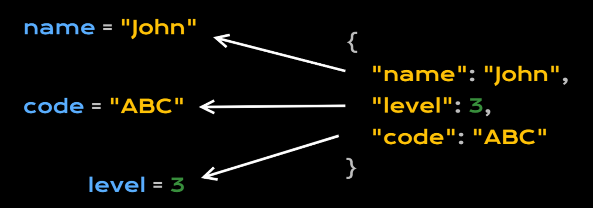

Hello, are you learning Python? Does your job involve using Python? If so, you will find this article quite interesting 😉.

This article is largely inspired by the destructuring assignment in JavaScript. While working with JavaScript, I became greatly fascinated with the destructuring assignment syntax in JavaScript, and I needed it in my Python code.

<!--truncate-->

## What is Destructuring in Python?

Destructuring syntax is an extremely useful feature in Python that breaks down values from lists, tuples, or dictionary attributes into individual variables. It helps us write clean and readable code.



Now, let’s explore it!

## Destructuring with Lists and Tuples

### Standard concept

We can easily unpack Lists or Tuples using the following syntax:

```python showLineNumbers
# list
first, second, third = [3, 6, 8]  
print(first)    # 3
print(second)   # 6
print(third)    # 8

# tuple
one, two, three = (1, 2, 3)
print(one)      # 1
print(two)      # 2
print(three)    # 3
```

These are just the standard concepts for destructuring lists or tuples. At this point, we should be concerned with the order and number of elements of a list or a tuple. 

- Using the wrong order will lead to incorrect data flow in the system. This can become a major issue for your system, where high data consistency is essential.
- If the number of variables to be unpacked is not equal to the length of the object. It will raise a `ValueError` exception. For example:

```python showLineNumbers
try:
    first, second, third, four = [3, 6, 8]  
except ValueError as e:
    print("ValueError -", str(e))
# ValueError - not enough values to unpack (expected 4, got 3)
```

### Ignoring values

In practice, there are many cases where we just want to unpack some values in a list or a tuple. How can we do that? Luckily, we have some syntax to make this more convenient. 

With an `_` character In place of a variable name. We can skip the unused element and move on to the next element in the list or tuple.

Code example:

```python showLineNumbers
one, _, three, _, _ = [1, 2, 3, 4, 5]
print(one, three)   # 1 3
```

### Assign the remaining values

In some cases, we still want to use the remaining values. The `*` operator will help us do it. In Python, we can use the `*` operator to collect leftover values when performing a destructuring assignment.

```python showLineNumbers
a, b, *re = ["a", "b", "c", "d", "e"]
print(a)    # a
print(b)    # b
print(re)   # ['c', 'd', 'e']

*start, end = ("dog", "cat", "frog", "crab")
print(start)    # ['dog', 'cat', 'frog']
print(end)      # crab
```

We can use the `_` character and the `*` operator together to ignore the remaining values.

```python showLineNumbers
a, *_ = ["a", "b", "c", "d", "e"]
print(a)    # a

start, *_, end = ("a", "b", "c", "d", "e")
print(start)    # a
print(end)      # e
```

## Destructuring in loops

We are familiar with the syntax of `for` loops. We can access each element in a list directly instead of using an index like in some other languages. This makes our code more Pythonic.

```python showLineNumbers
users = [
    ( 1, "Bach", "HCM" ),
    ( 2, "Nam", "HN" ),
    ( 3, "Trung", "NT" )
]

for user in users:
    print(user)
# (1, 'Bach', 'HCM')
# (2, 'Nam', 'HN')
# (3, 'Trung', 'NT')
```

With destructuring syntax, we can access individual attributes inside an element in for loops. We can write clearer and more readable code. For example:

```python showLineNumbers
users = [
    ( 1, "Bach", "HCM" ),
    ( 2, "Nam", "HN" ),
    ( 3, "Trung", "PR-TC" )
]

for id, name, city in users:
    print("Id:", id, "- Name:", name, "- City:", city)
# Id: 1 - Name: Bach - City: HCM
# Id: 2 - Name: Nam - City: HN
# Id: 3 - Name: Trung - City: PR-TC
```

Or you can even get the index of the element with the `enumerate` object.

> The enumerate object yields pairs containing a count (from start, which defaults to zero) and a value yielded by the iterable argument.
— [Python Docs](https://docs.python.org/2/library/functions.html?highlight=enumerate#enumerate) —
> 

```python showLineNumbers
users = [
    ( 1, "Bach", "HCM" ),
    ( 2, "Nam", "HN" ),
    ( 3, "Trung", "PR-TC" )
]

for index, (id, name, city) in enumerate(users):
    print("Index:", index, "- Id:", id, "- Name:", name, "- City:", city)
# Index: 0 - Id: 1 - Name: Bach - City: HCM
# Index: 1 - Id: 2 - Name: Nam - City: HN
# Index: 2 - Id: 3 - Name: Trung - City: PR-TC
```

Furthermore, we can combine the use of the ignore values syntax and collect the remaining values.

```python showLineNumbers
users = [
    [ 1, "Bach", "HCM", "Python" ],
    [ 2, "Nam", "HN", "JavaScript" ],
    [ 3, "Trung", "PR-TC", "TypeScript" ]
]

for id, _, *values in users:
    print("Id:", id, "- Value:", values)
# Id: 1 - Value: ['HCM', 'Python']
# Id: 2 - Value: ['HN', 'JavaScript']
# Id: 3 - Value: ['PR-TC', 'TypeScript']
```

## Destructuring dictionaries

In my work, I often encounter situations where I need to handle objects/dictionaries with many key-value pairs. 

### Standard concept

Let's evaluate the example below.

```python showLineNumbers
customer = {
    "first_name": "John",
    "last_name": "Cena",
    "age": 23,
    "email": "johncena@gmail.com"
}

one, two, three, four = customer
print(f"One '{one}', two '{two}', three '{three}', four '{four}'")
# One 'first_name', two 'last_name', three 'age', four 'email'

one, two, three, four = customer.values()
print(f"One '{one}', two '{two}', three '{three}', four '{four}'")
# One 'John', two 'Cena', three '23', four 'johncena@gmail.com'
```

In this example, when we try to get the variables `one`, `two`, `three`, and `four`, these variables will receive the corresponding values of the keys from the `customer` dictionary. Or we can get the list of values of the keys in that order by using the `.values()` method of the dictionary.

Instead of using the above approach, we can directly get the values from the dictionary using their keys. 

```python showLineNumbers
print(f"Customer email {customer['email']}, age {customer['age']}")
# Customer email johncena@gmail.com, age 23
```

If you access an unknown key, it will throw a `KeyError` exception.

### Advanced techniques

The above approaches are completely fine, and you can get the job done quickly without much effort.

But maintaining or reading that code is a nightmare. Imagine you have a dictionary with hundreds of keys (or even more), each part where you access a key of the dictionary and perform logic with it. After a few weeks or months, you get a task related to that code. That's where the nightmare begins.

To solve that problem, we should group the declarations of the variables we need to use together. And I found a way to do that while keeping our code clean and readable.

We can use [`operator`](https://docs.python.org/3/library/operator.html) module from the standard library as follows:

```python showLineNumbers
from operator import itemgetter

current_user = {
    "id": 1,
    "username": "pxuanbach",
    "email": "pxuanbach@gmail.com",
    "phone": "832819201",
    "full_name": "Bach Pham",
    "gender": "Male",
    "website": "immersedincode.io.vn"
}

id, email, gender, username = itemgetter(
    'id', 'email', 'gender', 'username'
)(current_user)

print("Id:", id, "- Email:", email, "- Gender:", gender, "- Username:", username)
# Id: 1 - Email: pxuanbach@gmail.com - Gender: Male - Username: pxuanbach
```

In the example above, the value of each variable will correspond to the order of keys in the `itemgetter` function. Additionally, If you access an unknown key, the function will throw a `KeyError` exception.

## Conclusion

So we've covered destructuring lists, tuples, for loops, and dictionaries. I hope this article is helpful to you.

If you need a project to run a demo on your environment, here is my [Git repository](https://github.com/pxuanbach/Destructuring-in-Python).

## References

- [Destructuring in Python (teclado.com)](https://blog.teclado.com/destructuring-in-python/)
- [Destructuring dicts and objects in Python (stackoverflow.com)](https://stackoverflow.com/a/63600600/22865115)