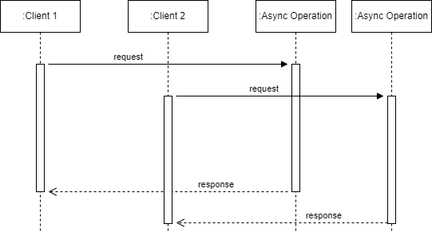
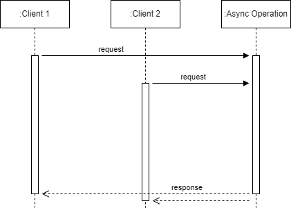
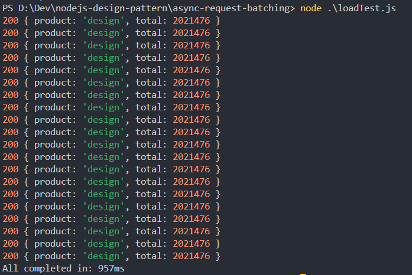
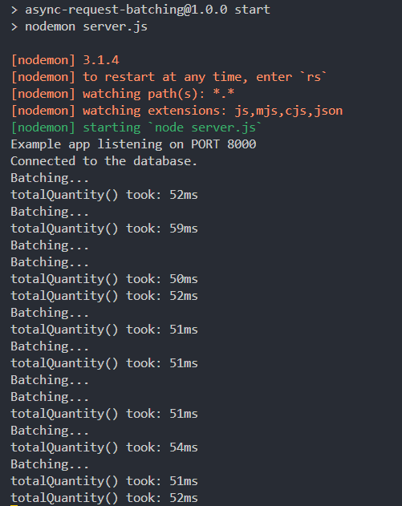
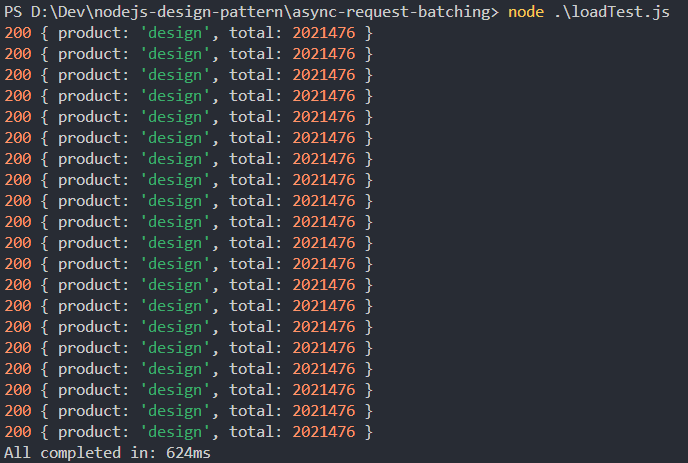

Hello, This is the first post when I migrated from Wordpress to Docusaurus.

Recently, I have been researching some design patterns in Node.js to apply to my team's project. Are you a fan of Node.js?

I have discovered some interesting patterns that can be applied to my project. Today, I will introduce the **Asynchronous Request Batching Design Pattern**. I'm really excited to share it with you.

<!--truncate-->

## Define the Problem

In reality, a large number of systems are expected to face issues with high throughput and large workloads. And the projects I have been assigned to are no exception 😁. So… what is the solution? At that time, I imagined a lot of solutions like caching, scaling, partitioning,…

Caching seems quite efficient. However, it comes with the challenge of invalidating cached data. Is there a similar approach to caching that doesn't involve worrying about data invalidation? Is there any simpler way?

The Asynchronous Request Batching Design Pattern appears. This design pattern is really appealing to me at the moment.

## Introduction to Asynchronous Request Batching

Let's say I export an API and the Client makes multiple requests to that API at the same time. The server receives those requests and processes them concurrently. Please look at the image below.

<div class="text--center">
  
</div>

In the example above, both Client 1 and Client 2 make requests to the server. Each request is considered an async operation. As the number of requests increases, the number of asynchronous operations that need to be executed also grows.

Now, let's talk about batching.

<div class="text--center">
    
</div>

Still using the example with Client 1 and Client 2, but this time, their requests are batched together and processed in just one async operation. By doing this, when the operation completes, both clients are notified, even though the async operation is actually executed only once. 

This approach offers a remarkably simple yet powerful way to optimize the load of an application. It avoids the complexity of caching mechanisms, which often require robust memory management and invalidation strategies.

## Normal API server

Let's consider an API server that manages the sales of an e-commerce company. Its task is to retrieve quantity information for hundreds of thousands of products from the database.

The schema used for this example is a simple table with three fields.

```sql showLineNumbers
CREATE TABLE sales (
  id INTEGER PRIMARY KEY AUTOINCREMENT,
  product varchar(255), 
  quantity bigint
)
```

The data processing operation is straightforward. It involves retrieving all records with the corresponding product and calculating their total quantity. The algorithm is intentionally slow as we want to highlight the effect of batching and caching later on. The routine would look as follows (file `totalQuantity.js`):

```jsx showLineNumbers title="./totalQuantity.js"
import db from './database.js';

export async function totalQuantity(product) {
  const now = Date.now();
  let sql = `SELECT product, quantity FROM sales WHERE product=?`;
  let total = 0;
  return new Promise(function (resolve, reject) {
    db.all(sql, [product], (err, rows) => {
      if (err) return reject();
      rows.forEach((row) => {
        total += row.quantity;
      })
      console.log(`totalQuantity() took: ${Date.now() - now}ms`);
      resolve(total);
    })
  })
}
```

Now, I will expose the `totalQuantity` API through a simple [Express.js](https://expressjs.com/) server (the `server.js` file):


```jsx showLineNumbers title="./server.js"
import express from 'express';
import { totalQuantity } from './totalQuantity.js';

const app = express();
const PORT = 8000;

app.get('/', (req, res) => {
  res.send('Hello World!');
})

app.get('/total-quantity', async (req, res) => {
  const { product } = req.query;
  const total = await totalQuantity(product);
  res.status(200).json({
    product,
    total
  })
})

app.listen(PORT, () => {
  console.log(`Example app listening on PORT ${PORT}`)
})
```

Before starting the server, we will generate some sample data. Leveraging SQLite's lightweight and efficient nature, I've chosen it as the database for this example. Furthermore, I have prepared a script to populate the sales table with 200,000 rows (the Github repository can be found in the conclusion section).

```bash
npm run populate
```

After seeding data:


Let's start the server now.

```bash
npm start
```

## Test scenario

To clearly illustrate the difference between a server without batching and one with a batching pattern, we will create a scenario with more than one request. So, we will use a script named `loadTest.js`, which sends 20 requests at intervals of 20ms. The request sending interval should be lower than the `totalQuantity` function's processing duration.

To run the test, just execute the following command:

```bash
node loadTest.js
```

Note the total time taken for the test.



The results of 3 test runs are 994ms, 954ms, 957ms ~ avg **968ms**.

Let's move on to the exciting part of today's discussion: optimizing asynchronous request processing using the batching pattern.

## Async request batching server

Now, we need to introduce an additional processing layer on top of the `totalQuantity` function. This is where we implement the mechanism of the batching pattern.

Now, imagine working with caching without worrying about cache invalidation. That makes it much easier to understand.

We will use a memory space to store the promises that need to be processed (it could be an array, map, dict, etc.). And we will differentiate them based on the input of the request. New requests with the same input will reference the promises stored in the memory space. When the promises complete, they will return results to all the requests referencing them, and then we will remove them from the memory space.

Now it's time to code.

```jsx showLineNumbers {3,6-8,11-14,16} title="./totalQuantityBatch.js"
import { totalQuantity as totalQuantityRaw } from "./totalQuantity.js";

const requestsQueue = new Map();

export function totalQuantity(product) {
  if (requestsQueue.has(product)) {
    console.log("Batching...")
    return requestsQueue.get(product);
  }

  const promise = totalQuantityRaw(product);
  requestsQueue.set(product, promise);
  promise.finally(() => {
    requestsQueue.delete(product)
  })
  return promise;
}
```

The `totalQuantity` function of `totalQuantityBatch` module can be considered a proxy for `totalQuantityRaw` function of `totalQuantity` module, let's see how it works:

1. In **line 3**, I define the variable `requestsQueue` as a Map to serve as temporary memory.
2. From **line 6-8**, we check if a request with the input “product” already exists in the temporary memory. If it does, we return the stored promises.
3. From **line 11-14**, If the input “product” does not exist, we start executing the `totalQuantityRaw` function and store it in the temporary memory. One nice thing is that we can leverage `.finally` to attach a callback that removes the promise from the temporary memory.
4. In **line 16**, return running promise.

After completing the logic in the `totalQuantityBatch` module, we need to update the `server.js` to incorporate the new logic.

```jsx showLineNumbers title="./server.js"
import express from 'express';
// import { totalQuantity } from './totalQuantity.js';
import { totalQuantity } from './totalQuantityBatch.js';
...
```

Restart the server and let's see how the results change.

<div class="text--center">
    
</div>

Let’s run the `loadTest.js` script:



The results of 3 test runs are 624ms, 648ms, 592ms ~ avg **621ms**.

We can clearly see that the processing time for all requests has been significantly reduced. To observe even greater efficiency, you can increase the number of records in the database to extend the processing time of the `totalQuantity` function.

## Notes

When implementing in a real-world project, we will use more advanced techniques to ensure the application operates reliably and smoothly.

- We will need a more optimized temporary memory space. A large number of requests to the server with different inputs later could cause the memory to expand significantly. You might consider using **LRU (Least Recently Used)** or **FIFO (First In, First Out)** methods for data management.
- You can also apply caching to enhance the effectiveness of this technique and standardize the stored data for easier sharing. Of course, you will need to address the issue of cache invalidation.
- When the application is distributed across multiple processes and instances, storing data in memory in different locations can lead to inconsistent results and become redundant. The solution is to use a shared storage. Common caching solutions include **Redis** ([Redis - The Real-time Data Platform](https://redis.io/)) and **Memcached** ([memcached - a distributed memory object caching system](https://memcached.org/)).

## Conclusion

I hope this post was useful. If you need a project to run a demo on your environment, here is my [Git repository](https://github.com/pxuanbach/nodejs-design-pattern).

See you again!

## References

- [Asynchronous Request Batching & Caching in Node.js | by Maharshi Shah | GoGroup Tech Blog](https://blog.gogroup.co/asynchronous-request-batching-caching-in-node-js-b724c8a92562)
- [Node.js Design Patterns Third Edition by Mario Casciaro and Luciano Mammino (nodejsdesignpatterns.com)](https://www.nodejsdesignpatterns.com/)
