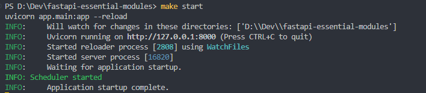
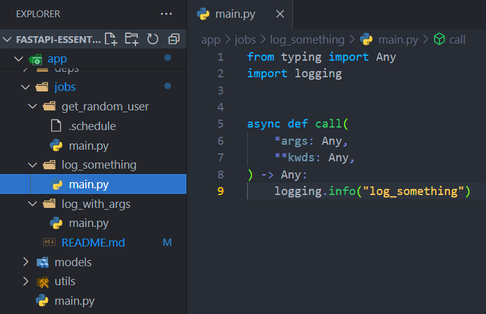
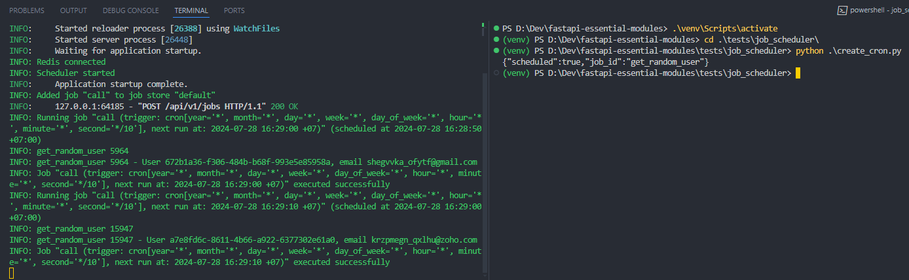
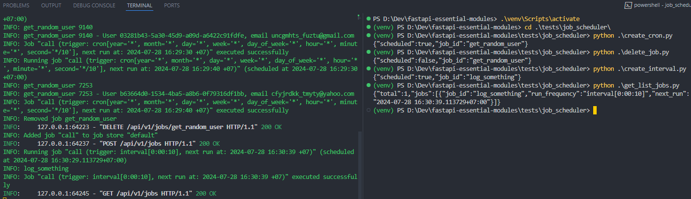

Welcome back!

In part 4 of our series, we delve deeper into essential tools that streamline development and enhance functionality. Let's dive in!

<!--truncate-->

## Framework/Library version

This project uses [Python](https://www.python.org/) 3.10 as the environment and [Poetry](https://python-poetry.org/) as the package manager.

The code and examples in this post will use frameworks/libraries with the following versions.

```toml showLineNumbers title="./pyproject.toml"
[tool.poetry.dependencies]
python = "^3.10"
uvicorn = {extras = ["standard"], version = "^0.24.0.post1"}
fastapi = "^0.109.1"
python-multipart = "^0.0.7"
email-validator = "^2.1.0.post1"
passlib = {extras = ["bcrypt"], version = "^1.7.4"}
tenacity = "^8.2.3"
pydantic = ">2.0"
emails = "^0.6"
gunicorn = "^21.2.0"
jinja2 = "^3.1.2"
alembic = "^1.12.1"
python-jose = {extras = ["cryptography"], version = "^3.3.0"}
httpx = "^0.25.1"
psycopg = {extras = ["binary"], version = "^3.1.13"}

sqlmodel = "^0.0.16"

# Pin bcrypt until passlib supports the latest
bcrypt = "4.0.1"
pydantic-settings = "^2.2.1"
sentry-sdk = {extras = ["fastapi"], version = "^1.40.6"}
psycopg2 = "^2.9.9"
asyncpg = "^0.29.0"
redis = {extras = ["hiredis"], version = "^5.0.3"}
orjson = "^3.10.0"
apscheduler = "^3.10.4"
```

## Job Scheduler

In the real world, the Job Scheduler module stands out as a fundamental tool for automating tasks and managing scheduled activities within web applications. FastAPI, with its asynchronous capabilities, integrates seamlessly with Job Scheduler modules, allowing efficient automation of recurring tasks.

I will introduce a library that I am using to build this module for my applications. It offers many options, powerful features, and operates flexibly. 

It's [APScheduler](https://github.com/agronholm/apscheduler) (6k stars, 693 forks on 28/07/2024). If you are wondering why, the answer comes from a ticket in my job, which required adding a feature to schedule certain tasks during the day in the FastAPI application. Then, I wandered through various blogs, forums, and stopped at a [discussion](https://github.com/tiangolo/fastapi/discussions/9143) in the FastAPI repository. Many libraries were mentioned, and then I stopped [here](https://github.com/tiangolo/fastapi/discussions/9143#discussioncomment-5157569). 

This library supports job storage with SQLAlchemy (`SQLAlchemyJobStore`) and job scheduling with asyncio (`AsyncIOScheduler`).

This library has three built-in scheduling systems

- Cron-style scheduling (with optional start/end times)
- Interval-based execution (runs jobs on even intervals, with optional start/end times)
- One-off delayed execution (runs jobs once, on a set date/time)

So, we can organize the module flexibly to take advantage of those benefits.

### Install

First, we should install the APScheduler package. 

```bash
poetry add apscheduler   # pip install apscheduler
```

### Prepare before coding

Because APScheduler provides flexibility in adding and removing jobs at runtime, I usually build it as a regular entity in the system. That means there will be APIs performing CRD operations for it (no need for U - Update, because we only need to delete and re-add that job back into the system).

We will have a separate database to store jobs, typically I will use SQLite or PostgreSQL. It's lightweight and compatible with SQLAlchemy (`SQLAlchemyJobStore`).

In practice, I almost exclusively work with tasks that use `cron` or `interval` triggers. I rarely use `date`. However, for the sake of completeness in this article, I will also write APIs to support it.

### Create a Scheduler instance

In the first steps, we just need to declare an instance representing the Scheduler.

```python showLineNumbers title="./app/core/scheduler.py"
from apscheduler.schedulers.asyncio import AsyncIOScheduler
from apscheduler.jobstores.sqlalchemy import SQLAlchemyJobStore
from app.core.config import settings

jobstores = { 'default': SQLAlchemyJobStore(url=settings.JOB_DATABASE_URI) }
scheduler = AsyncIOScheduler(jobstores=jobstores)
```

### Integration with FastAPI

We also use the lifespan function to manage the lifecycle of the scheduler instance.

```python showLineNumbers {9,18} title="./app/main.py"
from fastapi import FastAPI
from contextlib import asynccontextmanager
from app.core.scheduler import scheduler

@asynccontextmanager
async def lifespan(app: FastAPI):
    # start up
    try:
        scheduler.start() 
    except Exception as e:    
        logging.error("Unable to Create Schedule Object - [%s]", str(e))   
    yield
    # shut down
    scheduler.shutdown()
    
app = FastAPI(
    title=settings.PROJECT_NAME,
    lifespan=lifespan
)
```

When running the project, you will see the log printed on the console as follows:



This is just the warm-up part, now let's move on to the main part.

### Build Job Creation API

First of all, initialize an APIRouter instance and register it in the FastAPI application.

```python showLineNumbers title="./app/api/jobs.py"
import logging
from fastapi import APIRouter, HTTPException, Request, BackgroundTasks, status

router = APIRouter(prefix="/jobs")
```

```python showLineNumbers {4} title="./app/api/__init__.py"
from fastapi import APIRouter
from app.api import user, utils, jobs
...
router.include_router(jobs.router, tags=["Job"])
```

Now, let's talk about the interesting things about job creation API. As mentioned above, we will create an API to be able to create a new job while the application is running. 

#### Schema/Model

The payload schema would look as follows:

```python showLineNumbers title="./app/models/job.py"
from datetime import datetime
from typing import Any, List, Literal, Optional, Union
from sqlmodel import SQLModel

class CronArgs(SQLModel):
    year: Optional[str] = "*"
    month: Optional[str] = "*"
    day: Optional[str] = "*" 
    week: Optional[str] = "*"
    day_of_week: Optional[str] = "*"
    hour: Optional[str] = "*"
    minute: Optional[str] = "*"
    second: Optional[str] = "5"

class IntervalArgs(SQLModel):
    seconds: Optional[int] = 10
    minutes: Optional[int] = None
    hours: Optional[int] = None
    days: Optional[int] = None
    weeks: Optional[int] = None

class DateArgs(SQLModel):
    args: List[Any] = []
    run_date: datetime = datetime.now()

class JobCreate(SQLModel):
    job_id: str
    from_file: bool = True
    type: Literal['cron', 'interval', 'date'] = 'cron'
    args: Optional[Union[DateArgs, IntervalArgs, CronArgs]] = None
```

In this example, the API can create all 3 types of jobs simultaneously, so I designed it as above. However, it might be beneficial to decouple these functionalities for improved maintainability and extensibility.

#### API Logic

Next, let's take a quick look at this code snippet.

```python showLineNumbers {4-6,10-31,35,37-42} title="./app/api/jobs.py"
@router.post("", response_model=JobCreateDeleteResponse)
async def add_job_to_scheduler(obj_in: JobCreate) -> JobCreateDeleteResponse:
    # Find job folder
    job_folder = path.join("app", settings.JOB_DIR, obj_in.job_id)
    if not path.exists(job_folder):
        raise HTTPException(status_code=status.HTTP_404_NOT_FOUND, detail="Job folder not found.")
    
    _timers = obj_in.args
    # Get timer parameters if `.schedule` file exists
    if obj_in.from_file:
        _timers = {}
        _sched_path = path.join(job_folder, ".schedule")
        if not path.exists(_sched_path):
            raise HTTPException(status_code=status.HTTP_404_NOT_FOUND, detail="Schedule file not found")

        # read parameters from `.schedule` file
        sched = read_file_line_by_line(_sched_path)
        for i in range(len(sched)):
            if i == 0 or str(sched[i]).startswith('#') or sched[i] == '' or sched[i] is None:
                continue 
            _interval_timer = str(sched[i]).split("=")
            _timers.update({_interval_timer[0]: _interval_timer[1]})
    # Get cron-job timer parameters if type equals "cron"
    if obj_in.type == "cron":
        _timers = CronArgs.model_validate(_timers)
    # Get interval-job timer parameters if type equals "interval"
    elif obj_in.type == "interval":
        _timers = IntervalArgs.model_validate(_timers)
    # Get date-off job timer parameters if type equals "date"
    elif obj_in.type == "date":
        _timers = DateArgs.model_validate(_timers)

    # find job module in `./app/jobs` folder, 
    # register the `call` function inside the module to the scheduler with timer parameters
    _job_module = importlib.import_module(f"app.jobs.{obj_in.job_id}.main")
    try:
        job = scheduler.add_job(
            _job_module.call, 
            obj_in.type, 
            id=obj_in.job_id,
            **_timers.model_dump(exclude_none=True)
        )
    except ConflictingIdError:
        logging.warning(f"Job {obj_in.job_id} already exists")
        raise HTTPException(status_code=status.HTTP_409_CONFLICT, detail="Job already exists")
    except Exception as e:
        logging.error(f"Add job {obj_in.job_id} - {str(e)}")
        raise HTTPException(status_code=status.HTTP_400_BAD_REQUEST, detail="An error occurred")
    return JobCreateDeleteResponse(scheduled=True, job_id=job.id)
```

How does it work?

1. From line **4-6**, to register a job, we must define the job into `./app/jobs` folder. The name of the job folder must be equal to the `job_id`. For example:
    
    
    
2. From line **10-31**, I provide 2 options to create a new job.
    1. Register with `.schedule` file, this file will be placed in the job folder.
    2. Register via API payload (Schema/Model) that I mentioned above.
3. In line **35**, import the module dynamically using `job_id` via the `importlib` library.
4. From line **37-42**, try to register the job into the scheduler's job store.

We will test it later. Next I will introduce the Get all jobs API.

### Get All Jobs API

This API is simpler than Job Creation API.

The code will look like this:

```python showLineNumbers {4} title="./app/api/jobs.py"
@router.get("")
async def get_scheduled_jobs():
    schedules = []
    for job in scheduler.get_jobs():
        schedules.append({
            "job_id": str(job.id), 
            "run_frequency": str(job.trigger), 
            "next_run": str(job.next_run_time)
        })
    return { "total": len(schedules), "jobs": schedules }
```

How does it work?

1. It uses APScheduler’s `get_jobs` API to get all registered jobs.
2. Loop through all jobs to retrieve the necessary data.
3. Returns total number of registered jobs and job information.

### Delete Job API

Using the `job_id` as a unique identifier, we will invoke the APScheduler’s `remove_job` API to delete the corresponding job from the job store.

```python showLineNumbers {4} title="./app/api/jobs.py"
@router.delete("/{job_id}", response_model=JobCreateDeleteResponse)
async def remove_job_from_scheduler(job_id: str) -> JobCreateDeleteResponse:
    try:
        scheduler.remove_job(job_id)
    except Exception as e:
        logging.error(f"Delete job {job_id} - {str(e)}")
        raise HTTPException(status_code=status.HTTP_400_BAD_REQUEST, mdetail="Job deleted failed")
    return JobCreateDeleteResponse(scheduled=False, job_id=job_id)
```

## Let's see the results

I created some scripts in `./tests` folder for testing.

For instance, a script will look like:

```python showLineNumbers title="./tests/job_scheduler/get_list_jobs.py"
import requests

url = "http://localhost:8000/api/v1/jobs"
payload = ""
headers = {
    "Content-Type": "application/json",
}
response = requests.request("GET", url, data=payload, headers=headers)

print(response.text)
```

Let's see how our job scheduler looks like. 



First, I create a cron-job and look at the logs. As you can see, the job has been successfully registered in the job store and runs every 10 seconds.

Now, delete it using the `delete_job.py` script and create an interval job.



Wow, it’s work. Then test the Get all jobs API using `get_list_jobs.py` script. We can see it prints to the console that we have a total of 1 job in the job store.

## Notes

In addition to the benefits it brings, we also need to pay attention to a few other things:

- The use of an in-app scheduler can lead to higher resource consumption by the application, and it generates a larger amount of logs, which can make error tracking more challenging. To address this issue, you can separate it into a dedicated application specifically for executing scheduled jobs. Your main application can call the job scheduler app via HTTP, GRPC, etc., to register jobs into the job store.
- Beyond `AsyncIOScheduler`, APScheduler offers a variety of job schedulers and storage options. Explore the documentation to select the optimal tool for your system. https://apscheduler.readthedocs.io/en/3.x/userguide.html#choosing-the-right-scheduler-job-store-s-executor-s-and-trigger-s
- To avoid your scheduler consuming a lot of database connections, try to limit the number of concurrent executions. https://apscheduler.readthedocs.io/en/3.x/userguide.html#limiting-the-number-of-concurrently-executing-instances-of-a-job

Some packages that you may be interested in:

- [celery/celery: Distributed Task Queue (development branch) (github.com)](https://github.com/celery/celery) (24.2k stars, 4.6k forks on 28/07/2024)
- [samuelcolvin/arq (github.com)](https://github.com/samuelcolvin/arq) (2k stars, 170 forks on 28/07/2024) - *The author is the creator of [Pydantic](https://github.com/pydantic/pydantic), an important module integrated with FastAPI.*
- [dmontagu/fastapi-utils (github.com)](https://github.com/dmontagu/fastapi-utils) (1.8k stars, 163 forks on 28/07/2024)
- [aio-libs/aiojobs (github.com)](https://github.com/aio-libs/aiojobs) (821 stars, 66 forks on 28/07/2024)
- [madkote/fastapi-plugins (github.com)](https://github.com/madkote/fastapi-plugins) (355 stars, 19 forks on 28/07/2024)

## Conclusion

I hope this post was useful. If you need a project to run a demo on your environment, here is my [Git repository](https://github.com/pxuanbach/fastapi-essential-modules).

Have a great weekend!

## References

- https://apscheduler.readthedocs.io/en/3.x/userguide.html
- [how can i run scheduling tasks using fastapi's · tiangolo/fastapi · Discussion #9143 (github.com)](https://github.com/tiangolo/fastapi/discussions/9143)