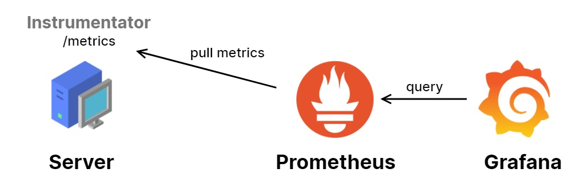

Hello, FastAPI and I are here to see you again. Over the past week, I started onboarding at a new company, joined a new environment, and met new people, which made me really excited.

Getting straight to today's main topic, I will introduce a module that integrates with FastAPI, which helps us track the statistics of each API in the application.

<!--truncate-->

## **Framework/Library version**

This project uses [Python](https://www.python.org/) 3.10 as the environment and [Poetry](https://python-poetry.org/) as the package manager.

The code and examples in this post will use frameworks/libraries with the following versions.

```toml
[tool.poetry.dependencies]
python = "^3.10"
uvicorn = {extras = ["standard"], version = "^0.24.0.post1"}
fastapi = "^0.109.1"
python-multipart = "^0.0.7"
email-validator = "^2.1.0.post1"
passlib = {extras = ["bcrypt"], version = "^1.7.4"}
tenacity = "^8.2.3"
pydantic = ">2.0"
emails = "^0.6"
gunicorn = "^21.2.0"
jinja2 = "^3.1.2"
alembic = "^1.12.1"
python-jose = {extras = ["cryptography"], version = "^3.3.0"}
httpx = "^0.25.1"
psycopg = {extras = ["binary"], version = "^3.1.13"}

sqlmodel = "^0.0.16"

# Pin bcrypt until passlib supports the latest
bcrypt = "4.0.1"
pydantic-settings = "^2.2.1"
sentry-sdk = {extras = ["fastapi"], version = "^1.40.6"}
psycopg2 = "^2.9.9"
asyncpg = "^0.29.0"
redis = {extras = ["hiredis"], version = "^5.0.3"}
orjson = "^3.10.0"
apscheduler = "^3.10.4"
prometheus-fastapi-instrumentator = "^7.0.0"
```

## Monitoring

I am confident that this is one of the most important modules when you want to deploy a product to a production environment.

Currently, many packages can help you monitor your FastAPI app. The package I like to use the most is [Prometheus FastAPI Instrumentator](https://github.com/trallnag/prometheus-fastapi-instrumentator) (919 stars, 83 forks on 03/09/2024). I often use it along with Prometheus and Grafana, creating visual dashboards from those metrics helps me easily monitor the application. I will discuss this stack in another article.



How it’s work?

1. The API server exports an endpoint `/metrics`, which tracks the HTTP request count, request/response size in bytes, request duration, and more.
2. We register the `/metrics` endpoint and set the crawl job duration for the Prometheus service. Next, this service automatically ingests metrics data from the API server, storing the collected data for analysis.
3. Grafana acts as an admin dashboard, retrieving data from Prometheus and visualizing it in specialized graphs, such as time-series, line charts.

Let's integrate this package with FastAPI and deploy Prometheus and Grafana to visualize its metrics.

### Integrating with FastAPI

We need to initialize an instance of the instrumentator and export it when the application starts.

```python {3,8,19-23} showLineNumbers title="./app/main.py"
from fastapi import FastAPI
from contextlib import asynccontextmanager
from prometheus_fastapi_instrumentator import Instrumentator

@asynccontextmanager
async def lifespan(app: FastAPI):
    # start up
    instrumentator.expose(app)
    yield
    # shut down
    pass

app = FastAPI(
    title=settings.PROJECT_NAME,
    openapi_url=f"{settings.API_STR}{settings.API_VERSION_STR}/openapi.json",
    generate_unique_id_function=custom_generate_unique_id,
    lifespan=lifespan
)
instrumentator = Instrumentator(
    should_group_status_codes=False,
    should_ignore_untemplated=True,
    excluded_handlers=[".*admin.*", "/metrics"],
).instrument(app)
```

After initializing and running the application, you can easily find monitoring metrics at the `/metrics` endpoint.


### Setting up Prometheus and Grafana services

To quickly see the results, I recommend that you simply copy and paste as instructed in this section. 

First, create a `docker-compose.yaml` file like this:

```yaml showLineNumbers title="./monitoring/docker-compose.yaml"
services:
  prometheus:
    image: prom/prometheus:v2.54.0
    volumes:
      - ./prometheus.yaml:/etc/prometheus/prometheus.yml
      - prometheus-data:/prometheus
    command:
      - '--config.file=/etc/prometheus/prometheus.yml'
    restart: unless-stopped

  grafana:
    image: grafana/grafana:10.4.7
    ports:
      - "3001:3000"
    volumes:
      - grafana-data:/var/lib/grafana

volumes:
  prometheus-data:
  grafana-data:
```

Next, create a `prometheus.yaml` file in the same location.

```yaml showLineNumbers {10} title="./monitoring/prometheus.yaml"
global:
  scrape_interval: 15s

scrape_configs:
  - job_name: fastapi
    scrape_interval: 15s
    scrape_timeout: 10s
    metrics_path: '/metrics'
    static_configs:
    - targets: ['host.docker.internal:8000']
```

You might be curious about the `host.docker.internal` address. What is it?

- The reason for this is that Docker network works differently on Linux, Windows, and macOS.
- On Linux, Docker uses the system's built-in networking features.
- But on Windows and macOS, Docker runs inside a virtual machine. Because of this, Windows and macOS need a special way for containers to talk to the host machine, which is why we use `host.docker.internal`.

Since my OS is Windows, I'm using it as the host for the Prometheus service so that it can call the FastAPI server, which is not containerized.


Now, docker compose up!

```bash
docker compose -f ./monitoring/docker-compose.yaml up -d
```


### Configuring Grafana Dashboard

Once the services are up and running, you will see logs for requests to the /metrics endpoint being generated every 15 seconds (the `scrape_interval` of Prometheus).


Next, open your browser and go to `127.0.0.1:3001`; the Grafana login page will appear. The default username and password are **admin**.

After logging in, add Prometheus as a Data source with the connection URL set to `http://prometheus:9090`.

Why is `prometheus:9090`? 

- Containers with a shared Docker Compose configuration can communicate with each other using the service name as the domain.
- 9090 is the default port of the Prometheus service.


Back to Home, click “Create your first dashboard” > "Import a dashboard”. You will see the following screen.


You can easily find the [`dashboard.json`](https://github.com/pxuanbach/fastapi-essential-modules/blob/module/monitoring/monitoring/dashboard.json) file in my github repository. Import that file and see the result.


Niceee!!!

## Notes

These are not all the statistics that need to be tracked. In the real world, we need to track many more statistics, such as logs, RAM usage, CPU usage, total connections used, etc. However, for the scope of this article, this is enough to show you how we can monitor a FastAPI application.

Additionally, I would like to mention the use of packages that help monitor the application. These packages also consume resources to monitor the system, and they can become a performance bottleneck for the application. Always use it carefully, so you don't get into a mess.

Furthermore, you can also refer to a few other libraries such as…

- [stephenhillier/starlette_exporter](https://github.com/stephenhillier/starlette_exporter) (310 stars, 35 forks on 03/09/2024)
- [perdy/starlette-prometheus](https://github.com/perdy/starlette-prometheus) (272 stars, 31 forks on 03/09/2024)
- [acidjunk/starlette-opentracing](https://github.com/acidjunk/starlette-opentracing) (66 stars, 6 forks on 03/09/2024)
- [open-telemetry/opentelemetry-instrumentation-fastapi](https://github.com/open-telemetry/opentelemetry-python-contrib/tree/main/instrumentation/opentelemetry-instrumentation-fastapi) (###)

## Conclusion

I hope this post was useful. If you need a project to run a demo on your environment, here is my [Git repository](https://github.com/pxuanbach/fastapi-essential-modules/tree/module/monitoring).

See you again!

## References

- [Kludex/fastapi-prometheus-grafana: FasAPI + Prometheus + Grafana! :tada: (github.com)](https://github.com/Kludex/fastapi-prometheus-grafana?tab=readme-ov-file)
