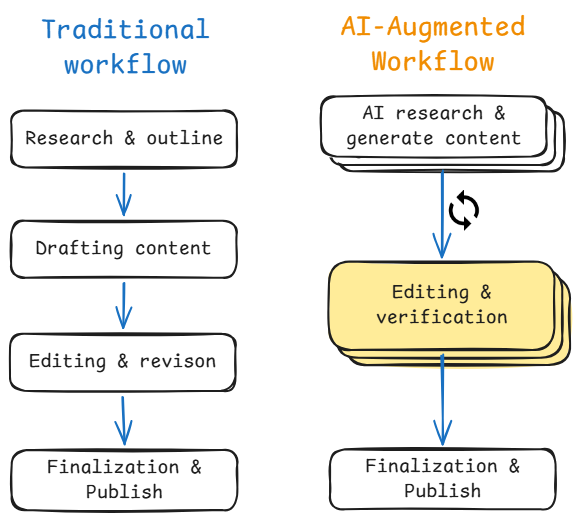
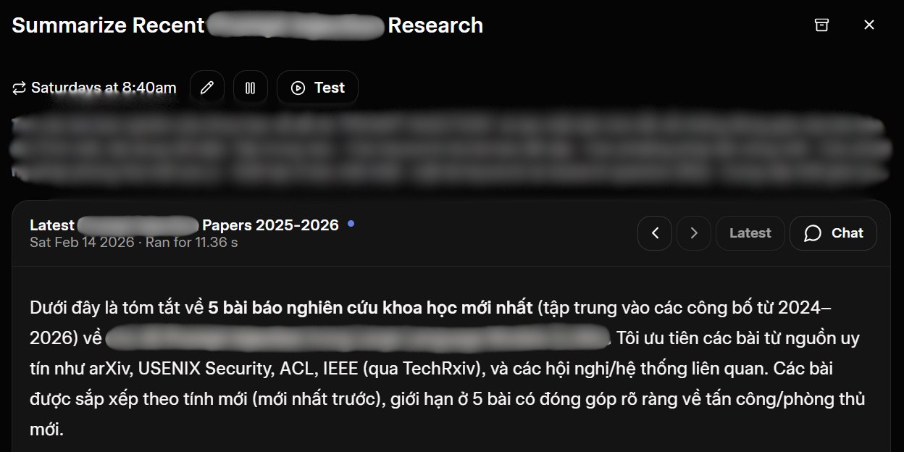

Hi folks! How was everyone's 2025?

Actually, 2025 was quite a hectic year for me, and I recently remembered that I have a blog that I have not updated for a long time. So here I am, writing a new post about AI/LLM agents.

<!--truncate-->

*Disclaimer: This post is not meant to be a comprehensive guide on how to use AI agents, but rather a reflection of my personal experiences and perspectives on the topic.*

## My perspective

AI Agents bring a lot of benefits to my work. But please keep in mind that AI agents are not perfect. They can make mistakes, and they require human oversight to ensure accuracy and reliability. However, when used correctly, they can be powerful allies in our work.

One thing I really like about AI assistants is that they can efficiently complete my tasks, as long as I know how to complete them 😅.

A tutor at my school said: "AI only accounts for 30% of the work; the rest depends on human creativity and critical thinking". That means your question/prompt is taking up to 70% of the success of your task.

### The "Wow" Factor vs. Technical Reality

Sometimes, AI can subtly point out where your weaknesses lie. You might look at a generated line of Python code and think, "Wow, that's clean/well-architected!", but a Python developer might look at the same code and point out that it's unoptimized, introduces too many changes to the codebase, or simply doesn't follow best practices.

For non-tech individuals, "vibe-coding" an app can be empowering. They can build something that solves a small problem or addresses a specific aspect they care about, leading to a satisfying "Wow, it works!" moment.

However, for technical people, the perspective is different. When we "vibe-code" or prototype with AI, we can't just stop at "it works." We have to look at the codebase, the structure, optimization, and product requirements. Everything needs to be clearly defined so that the generated code is stable, consistent with the existing codebase, and maintainable in the future.

Some survey data from Stack Overflow in 2025 shows the reality of AI-generated code in the industry. Most respondents (72%) stated they do not practice "vibe coding", with an additional 5% emphatically rejecting it as part of their workflow [[ref]](https://survey.stackoverflow.co/2025/ai#developer-tools-ai-explain). Among over 31,000 survey participants, 66% of developers chose "AI solutions that are almost right, but not quite," and 45% of developers said "Debugging AI-generated code is more time-consuming" [[ref]](https://survey.stackoverflow.co/2025/ai#developer-tools-ai-frustration).

### AI as Workflow Optimization

Fundamentally, working with AI is like optimizing your workflow. But optimization isn't always straightforward.

AI tends to increase pressure on specific points in your workflow. It can generate output effectively, but it can also generate "garbage" or create additional downstream work.

For example, when using AI to generate a blog post, you might get a draft very quickly. But this shifts the workload: now you have to read, edit, verify, and sometimes even rewrite significant portions. You've increased the pressure on the "editing" phase. If you simply add AI without removing redundant steps elsewhere in your process, you create an imbalance. You end up creating more work for one position instead of streamlining the whole process.

In software development, reviewers may need to spend more time examining the "source code" of team members, which can be more time-consuming than writing the code. Or, just send a text message "LGTM" 😂, no risk involved, trust me bro!

> More developers actively distrust the accuracy of AI tools (46%) than trust it (33%), and only a fraction (3%) report "highly trusting" the output. Experienced developers are the most cautious, with the lowest "highly trust" rate (2.6%) and the highest "highly distrust" rate (20%), indicating a widespread need for human verification for those in roles with accountability. [*— Stack Overflow 2025 Developer Survey —*](https://survey.stackoverflow.co/2025/ai#developer-tools-ai-acc)

Balancing this workflow is key to actually saving time and energy.

I saw an interesting [point](https://www.reddit.com/r/AI_Agents/comments/1qz9rip/i_spent_a_week_testing_openclaw_cool_demo_but_i/) on Reddit recently regarding OpenClaw. A guy noted that instead of doing less work, he ended up with just another thing to manage.

## Personal Use-Cases

Currently, I primarily use AI apps that streamline my workflow and provide results with citations, allowing me to trace sources and verify the accuracy of the information.

Some use-cases I can share:

**Studying and learning**: NotebookLM and Google AI Studio are my go-to tools for learning new topics and keeping updated with the latest research. What I prepare is a good prompt/form to guide the AI to give me the right information I need. Guiding AI to generate content following summarization frameworks like the Feynman Technique, PACES, or SQ3R effectively improves the quality of the output.

**Coding tasks**: GitHub Copilot is my main assistant for coding. It helps me write code faster and more efficiently, but I always review and optimize the generated code to ensure it meets my standards and fits well with the project's goals. Fortunately, Copilot has significantly improved its utility tools and integrates with various LLMs.

I also use Antigravity to access more LLM resources 😅 I like the way AI generates implementation plans that I can review and comment on to adjust. I think that IDE has a lot of work to do to surpass the experience offered by VS Code. 

At this point, why GitHub Copilot? Nah, this isn't a recommendation, it's just me sharing my preference. My company provides the GitHub Copilot Enterprise plan, so I just want to use a "tool" to serve my workflow (work and personal tasks).

**Automation tasks**: Grok Tasks is a great tool for researching and automating repetitive tasks. I have some tasks about searching for newest papers and financial news. Hmmm, maybe, I can create a task to write a blog about trending topics in Technology and post to this blog???? Haha, nvm 😂 I only want to push something that I really think about to this place.

## Conclusion

Honestly, this post was generated with the help of AI. I took some keynotes and ideas that I wanted to share, and then I used AI to help me structure and write the content. In addition, before generating the content, I prompted the Agent to read all of my blogs and understand my writing style.

But don't worry, this blog still conveys my ideas and perspectives, which form "the soul" of the content. AI is just a tool to help me express those ideas more efficiently. I hope this post gives you some insights and maybe inspires you to explore how they can fit into your own work!

Happy new year, and I hope you have a great 2026!

## References

- [AI 2027](https://ai-2027.com/)
- [AI | 2025 Stack Overflow Developer Survey](https://survey.stackoverflow.co/2025/ai)

