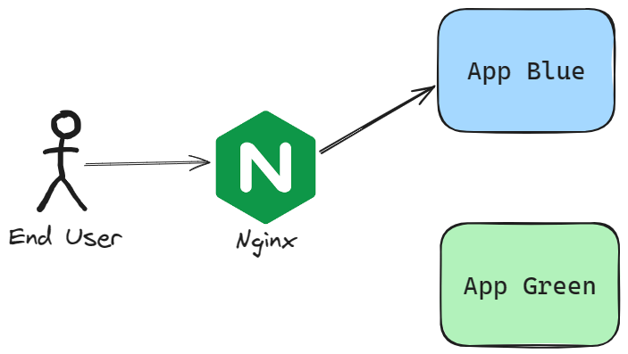
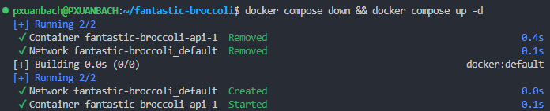

Hey, welcome to my blog!

## Lời mở đầu

Vài tháng trước, mình đã làm việc trong một dự án sử dụng Docker và Nginx để triển khai sản phẩm trên Digital Ocean Droplet. Mọi thứ vào thời điểm đó khá đơn sơ, mình phải thiết lập mọi thứ từ đầu. Từ việc dockerize ứng dụng đến tạo pipeline CI/CD để build, quản lý và triển khai các phiên bản Docker image khác nhau.

<!--truncate-->

Để mà nói thì, Docker là một công cụ tuyệt vời và mình thích sử dụng nó để tối ưu hóa hiệu suất làm việc của mình và team. Mình định nghĩa các Docker service trong tệp cấu hình, sau đó pull image mới, rồi down và up các container để đảm bảo chúng được cập nhật image mới. Có một vấn đề là: khi mình down và up Docker container sẽ có downtime. Tổng thời gian ngừng hoạt động khoảng **2 phút**. Đối với một sản phẩm được triển khai lên production thì đó là điều không thể chấp nhận được.



Vì vậy, mình quyết định triển khai chiến lược Zero downtime deployment cho dự án đó. Cụ thể là BLUE-GREEN Deployment. Đây là một quy trình triển khai dự án cơ bản, nhưng đơn giản và hiệu quả để giúp chúng ta hoàn thành công việc. 
Giờ thì hãy nói về một số cấu hình trước khi áp dụng chiến lược mới.

## Cấu hình trước khi áp dụng

### Docker Compose

Mình sẽ có tệp cấu hình như thế này:

```yaml showLineNumbers title="./docker-compose.yml"
services:
  api:
    image: pxuanbach/simple-app
    ports:
      - '8000:8000'
    restart: on-failure
```

### Nginx

Cấu hình `nginx.conf` sẽ trông như sau:

```plaintext {5} showLineNumbers title="./nginx.conf"
server {
    listen 80 default_server;
    server_name api.app.com;
    location / {
        proxy_pass http://localhost:8000;
        proxy_set_header X-Forwarded-For $proxy_add_x_forwarded_for;
        proxy_set_header Host $host;
        proxy_http_version 1.1;
        proxy_set_header Upgrade $http_upgrade;
        proxy_set_header Connection "upgrade";
        client_max_body_size 64M;
    }
}
```

### Quy trình triển khai

Nó rất đơn giản, chỉ cần chạy lần lượt các lệnh sau:

```bash {5} showLineNumbers
docker compose pull

docker compose down

# ---DOWNTIME HERE---

docker compose up
```



Giờ thì hãy cùng mình đến với phần áp dụng chiến lược mới.

## Cấu hình mới

### Docker Compose

Để áp dụng chiến lược BLUE-GREEN vào, mình cần cập nhật lại tệp cấu hình này một chút. Tính năng **Anchors and aliases** giúp chúng ta có thể tạo block tái sử dụng được. Tính năng này giúp chúng ta định nghĩa service BLUE và GREEN với cùng cấu hình. Ở đây mình chỉ thay đổi PORT của service.

```yaml showLineNumbers title="./docker-compose.yml"
services:
  api_blue: &api
    image: pxuanbach/simple-app
    ports:
      - '8000:8000'
    restart: on-failure

  api_green: 
    <<: *api
    ports:
      - "8001:8000"
```

### Nginx

Chúng ta sẽ tạo một bản sao của `nginx.conf` tương ứng với tên và PORT của service đã định nghĩa ở trên. Ví dụ như `api_green.conf`:

```plaintext showLineNumbers title="./api_green.conf"
server {
    listen 80 default_server;
    server_name api.app.com;
    location / {
        proxy_pass http://localhost:8001;
        ...
    }
}
```

### Áp dụng Zero Downtime Deployment

Để đạt được mục tiêu, mình sẽ sử dụng tập lệnh `Bash`. Mục tiêu của nó là triển khai chiến lược BLUE-GREEN bằng cách xác định service nào, BLUE hay GREEN, hiện đang hoạt động và sau đó cập nhật và khởi động service không hoạt động. Để tránh downtime, mình sẽ cập nhật cấu hình Nginx trước khi xóa container cũ.

```bash showLineNumbers title="./pull.run-service.sh"
#!/bin/bash

# Step 1
BLUE_SERVICE="api_blue"
BLUE_SERVICE_PORT=8000
GREEN_SERVICE="api_green"
GREEN_SERVICE_PORT=8001

TIMEOUT=60  # Timeout in seconds
SLEEP_INTERVAL=5  # Time to sleep between retries in seconds
MAX_RETRIES=$((TIMEOUT / SLEEP_INTERVAL))

# Step 2
if docker ps --format "{{.Names}}" | grep -q "$BLUE_SERVICE"; then
  ACTIVE_SERVICE=$BLUE_SERVICE
  INACTIVE_SERVICE=$GREEN_SERVICE
elif docker ps --format "{{.Names}}" | grep -q "$GREEN_SERVICE"; then
  ACTIVE_SERVICE=$GREEN_SERVICE
  INACTIVE_SERVICE=$BLUE_SERVICE
else
  ACTIVE_SERVICE=""
  INACTIVE_SERVICE=$BLUE_SERVICE
fi

echo "Starting $INACTIVE_SERVICE container"

docker compose pull $INACTIVE_SERVICE

docker compose up -d $INACTIVE_SERVICE

# Step 3
# Wait for the new environment to become healthy
echo "Waiting for $INACTIVE_SERVICE to become healthy..."
sleep 10

i=0
while [ "$i" -le $MAX_RETRIES ]; do
  HEALTH_CHECK_URL="http://localhost:8000/health"
  if [ "$INACTIVE_SERVICE" = "$BLUE_SERVICE" ]; then
    HEALTH_CHECK_URL="http://localhost:$BLUE_SERVICE_PORT/health"
  else
    HEALTH_CHECK_URL="http://localhost:$GREEN_SERVICE_PORT/health"
  fi

  response=$(curl -s -o /dev/null -w "%{http_code}" $HEALTH_CHECK_URL)
  # Check the HTTP status code
  if [ $response -eq 200 ]; then
      echo "$INACTIVE_SERVICE is healthy"
      break
  else
      echo "Health check failed. API returned HTTP status code: $response"
  fi
  i=$(( i + 1 ))
  sleep "$SLEEP_INTERVAL"
done

# Step 4
# update Nginx config
echo "Update Nginx config to $INACTIVE_SERVICE"
cp ./$INACTIVE_SERVICE.conf /your/config/path/api.conf
# restart nginx
nginx -s reload;

sleep 5

# Step 5
# remove OLD CONTAINER
echo "Remove OLD CONTAINER: $ACTIVE_SERVICE"
docker compose rm -fsv $ACTIVE_SERVICE

# remove unused images
(docker images -q --filter 'dangling=true' -q | xargs docker rmi) || true
```

Giải thích từng bước của tập lệnh trên:

1. Mình định nghĩa tên và PORT của các service BLUE và GREEN. Và thời gian retry tối đa để kiểm tra trạng thái của container (Giá trị này phụ thuộc vào thời gian khởi tạo container của bạn). 
Sau đó tiến hành pull phiên bản mới của Docker image về.
2. Dùng lệnh `docker ps` để tìm service không hoạt động và khởi động nó.
3. Kiểm tra trạng thái của container mới được khởi tạo.
4. Cập nhật tệp cấu hình Nginx và reload. Sử dụng `*nginx -s reload*` để reload lại cấu hình Nginx **thường không gây ra thời gian chết**. Điều này là do lệnh chỉ yêu cầu Nginx tải lại cấu hình của nó, chứ không khởi động lại toàn bộ quy trình.
5. Dọn dẹp một vài thứ không sử dụng (phiên bản Docker image cũ, container cũ)

Trong một số trường hợp, lệnh `docker compose rm -fsv` có thể sẽ không hoạt động. Có thể thay đổi bằng lệnh sau:

```bash showLineNumbers
docker compose stop $ACTIVE_SERVICE
docker compose rm -f $ACTIVE_SERVICE
```

Với tập lệnh trên, chúng ta có thể dễ dàng triển khai phiên bản mới một cách dễ dàng.

```bash showLineNumbers
./pull.run-service.sh
```

# Tổng kết

Như bạn thấy, chúng ta có thể tự động hóa quá trình triển khai chỉ với 1 tập lệnh `Bash`. Mục tiêu chính là chuyển hướng proxy đến container mới nhất và sau đó xóa container cũ.

Nếu bạn cần một project để chạy thử trên máy của bạn, đây là [Git repository](https://github.com/pxuanbach/demo-blue-green-deployment).

# Tham khảo

- [Zero-Downtime Deployments with Docker Compose – Max Countryman](https://www.maxcountryman.com/articles/zero-downtime-deployments-with-docker-compose)
- [docker compose rm | Docker Docs](https://docs.docker.com/reference/cli/docker/compose/rm/)